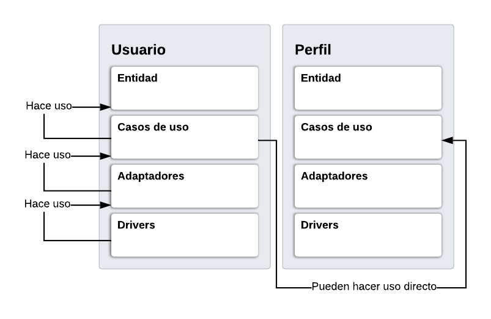

# Estructura del API - Proyecto Gazelook

La estructura del proyecto fue elaborado aplicando los principios de Clean Architecture del Tio Bob. Una guia para escribir codigo facil de escalar.


### Resumen

- La estructura del proyecto esta elaborada de forma tal que cada entidad de tu modelo de negocio represente un folder individual que incluya todas las capas relacionadas siguiendo los principios de una arquitectura limpia.
- Soporta varias versiones del api al mismo tiempo, dependiendo de los archivos de rutas que esten activos.
- Independiente del framework, se puede migrar sin necesidad de hacer grandes cambios en la estructura del proyecto.
- Validacion de esquemas para el manejo de datos de forma dinamica.

### Ejemplo de implementacion con dos entidades: Usuario y Perfil.



#### Consideraciones:

- Siguiendo el principio de una Clean Architecture, el flujo entre las capas de una entidad es de abajo hacia arriba, las capas superiores no pueden depender de las inferiores.
- La casos de uso de una entidad pueden hacer uso de los casos de uso de otra entidad de forma directa, sin necesidad de pasar por la capa de adaptadores.

### Descripcion general de la estructura del proyecto

#### De forma general

#### **Drivers**
- Contenido que depende explicitamente del framework o librerias, es de caracter compartido para todas las entidades en general.

Por cada entidad de tu negocio:

#### **Entidad**
- Se encarga de la creacion, validacion y lectura de cada entidad del modelo de negocio. Esta descrito de forma general usando logica personalizada sin incluir o depender de los modelos de implementacion de la base de datos a utilizar.
#### **Casos de uso**
- Se encarga de manejar el flujo de datos hacia la BD, depende de la **Entidad** para validar, crear y leer registros en la BD.
- En caso de haber casos de uso que dependan de otros, se debe hacer la llamada de forma directa sin hacer uso del adaptador al que pertenezca.
#### **Adaptadores**
- Permiten que los **Drivers** ejecuten por cada Request el caso de uso pertinente, sin depender del framework.
#### **Drivers**
- Dependen del framework que se utilice. Se encarga de organizar los Request disponibles por cada version del api. Solo tiene comunicacion con los **Adaptadores**.

### Framework, librerias y demas utilizadas en este proyecto

- Node JS + Express + TypeScript
- MongoDB + Moongose
- @hapi/joi (Esquemas y demas)
- log4js (Archivos de Log)
- config (Para entornos de desarrollo)

### Comandos para ejecutar el servicio

- Clonar el repositorio: **git clone https://daatky@bitbucket.org/daatky/api_gaze.git**
- Ubicarse en la terminal en la carpeta del proyecto y ejecutar **npm i**
- Ejecutar el servicio de forma normal: **npm run only-dev**
- Ejecutar el servicio con nodemon: **npm run nodemon-dev**

### Arbol de contenido
```bash
============= Entornos de desarrollo ======================================================================================================
config                                // Contiene los scripts que agrupan las variables para cada entorno
  L default.ts                        // Entorno de desarrollo - Por defecto
  L production.ts                     // Entorno de produccion
  L test.ts                           // Entorno de prueba
============= Archivos de log =============================================================================================================
logs                                  // Contiene los archivos de log para cada entorno
  L development.log                   // Log para entorno de desarrollo
  L production.log                    // Log para entorno de produccion
  L test.log                          // Log para entorno de prueba
============= Contenido compartido y entidades ============================================================================================
src                       
  L drivers                           // Contenido compartido para todas las entidades
    L express-callback    
      L index.ts                      // Metodo generico para manejar cada request que llegue al API.
    L hapi_joi            
      L schemas
        L usuarios.ts                 // Ejemplo de esquema para la data de acceso de un usuario
        L index.ts                    // Expone todos los esquemas activos
      L validator
        L validator.js                // Validador generico para cualquier esquema
    L logging
      L logger.ts                     // Metodo generico para la gestion de los archivos de log
    L moongose
      L modelos
        L usuarios                    // 
          L usuarioModelos.ts         // Schema de Moongose para un usuario
        L index.ts                    // Expone todos los schemas de moongose
    L not-found
      L not-found.ts                  // Modelo generico de respuesta para una request no existente
    L routes
      L api_v1.ts                     // Agrupa y expone las rutas para la v1 del api, cada version implica un archivo diferente
  L entidades                         // Organizacion por capas para cada entidad
   L usuario                          // Para entidad usuario, ejemplo de referencia
    L entidad
      L usuarioEntidad.ts             // Modelo que aplica logica personal, no tiene dependencias pero si injecciones
      L index.ts                      // Construye y expone la entidad a las demas capas
    L casos_de_uso
      L v1                            // Agrupa los casos de uso para la entidad usuario de la v1 del api
        L caseCrearUsuario.ts         // Ejemplo de caso de uso, crear usuario
        L caseObtenerUsuarios         // Ejemplo de caso de uso, obtener todos los usuarios
        L index.ts                    // Expone todos los casos de uso de la entidad usuario a las demas capas y entidades
      L mapper.ts                     // Mapea el objeto de la BD a un JSON
    L adaptador
      L v1                            // Agrupa los adaptadores de la entidad usuario de la v1 del api
        L adapterCrearUsuario.ts      // Permite al driver ejecutar el caso de uso de ejemplo: crear usuario
        L adapterObtenerUsuarios.ts   // Permite al driver ejecutar el caso de uso de ejemplo: obtener usuarios
        L index.ts                    // Expone todos los adaptadores de la entidad usuario de la v1 del api
    L drivers
      L usuario_api_v1.ts             // Expone todos los request disponibles en la v1 del api para la entidad usuario
  L container.ts                      // Contenedor principal, agrupa todos los requerimientos para levantar el servicio
  L index.ts                          // Archivo principal, ejecuta el servicio
============= Configuracion de nodemon ====================================================================================================
util
  L nodemon.json                      // Configuracion de nodemon
============= General =====================================================================================================================
package.json                          // Paquetes y demas, comandos npm para correr el servicio, para hacer build y demas
tsconfig.json                         // Configuracion para TypeScript
tslint.json                           // Configuracion de Eslint para TypeScript
.gitignore                            // Directorio y archivos excluidos del repositorio del proyecto
```